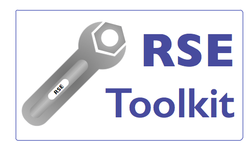

# RSE Toolkit: The Research Software Engineer's Toolkit

The RSE Toolkit (referred to as RTK in this README) is intended to be a community developed resource for Research Software Engineers (RSEs), researchers, academics and anyone involved in building research software. If you're a user of research software, or you're new to the field, you may also find a range of useful information in this repository.

## Why RTK?

This started out as an idea quite sometime ago (indeed this repository was created a long time ago without any activity!). The RSE community in the UK and beyond has been developing rapidly with groups and communities being started and growing at quite a pace as the interest in research software engineering continues to increase. 

There is a wealth of information out there but there is so much information, it can sometimes be difficult to find what we're looking for, or more generally, to find a summary of the things it is useful to know or be aware of as an RSE.

The initial list of resource areas for RTK is likely to change over time. Some elements may grow, others may disappear and new areas are likely to be added.

It's taken some time to get round to working on this but it's hoped that this initial bootstrapping phase will result in RTK gaining contributions and developing as a community resource.

## RTK Resources

The core set of resources that RTK is aiming to develop initially is:

 - **Tech Hub:** A place to find details of the most important technical skills that RSEs can learn, why they're important and where to learn them! The Tech Hub will also include overviews of key technical areas such as testing, CI, CD, etc.

 - **Training Hub:** A place to find a summary of the different things that it's important to know as an RSE, categorised by specific RSE role and career aims, as well as a comprehensive directory of RSE training resources.

 - **Research Hub:** Information on RSE-related research resources, how to get research credit for your RSE work if you're a research-focused RSE and advice and links to resources to help develop your research profile as an RSE.

 - **rtk:** A Python command line tool with pluggable modules for undertaking common RSE tasks - develop and contribute your own modules or help to extend existing code.

The RTK resources will be available through the GitHub pages site for RTK and can be accessed at [https://jcohen02.github.com/RSEToolkit](https://jcohen02.github.com/RSEToolkit).

## Contributing

Contributions to RTK are welcome. Full contributing guidelines will follow soon. In the meantime, feel free to raise a PR with information you'd like to add, or create an issue highlighting anything that you'd like to see available via this resource.
